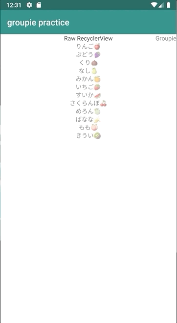

# 何を作ったの？  
Groupieの勉強がてら、同じものを普通にRecyclerViewで作るとどれだけ違うのか一番簡単なもので比較するものを作った。  
# 動き
ViewPagerの最初に普通にRecyclerViewで作ったもの、2つ目にGroupieを使ったものになっている。  

# どんな構成？
xmlやViewModel等は共通のものを使うようにしている。(そのせいでadapterをviewModel経由で渡せていないが。。。)
詳しくはQiitaに書いたから読んで！　→　[Groupieと生のRecyclerViewの比較](https://qiita.com/kkt_yu/items/a514b3a774da1cc287c8)  
## **[重要]ついでにいいねもして！**